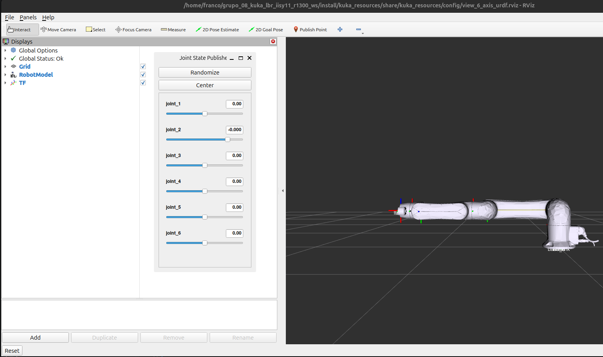

# Cinemática del Robot KUKA LBR iisy 11 R1300 (ROS 2)

## 1. Información General
* **Proyecto:** Implementación, simulación y validación de los nodos de Cinemática Directa (FK) e Inversa (IK).
* **Modelo del Robot:** KUKA LBR iisy 11 R1300 (6 DOF).
* **Autores (Grupo 08):**
  * Franco Joaquin Ramos Mamani
  * Gustavo Miranda Espada

---

## 2. Software y Versiones Requeridas
* **Sistema Operativo:** Ubuntu 24.04 LTS (Noble Numbat)
* **Middleware ROS:** ROS 2 Jazzy Jalisco
* **Lenguaje:** Python 3.12+ (con librerías `numpy`, `rclpy` y `setuptools`)

---

## 3. Instalación y Configuración del Workspace
El repositorio incluye scripts automatizados para la gestión de dependencias de sistema, paquetes del robot y la compilación del espacio de trabajo.

### Clonación e Instalación:
```bash
# 1. Clonar el repositorio
git clone [https://github.com/francoramos312/Grupo_8_Ramos_Miranda_kuka_lbr_iisy11_r1300_ws.git](https://github.com/francoramos312/Grupo_8_Ramos_Miranda_kuka_lbr_iisy11_r1300_ws.git)
cd Grupo_8_Ramos_Miranda_kuka_lbr_iisy11_r1300_ws

# 2. Otorgar permisos e instalar dependencias
chmod +x *.sh
./instalar.sh

# 3. Carga del Entorno:
source entorno.sh
```
## Comandos de ejecucion y Pruebas
1. Lanzar simulacion (Terminal 1):
```bash

ros2 launch grupo08_kuka_iisy11_bringup display.launch.py
```
Resultado esperado 


2. Ejecutar el nodo de Cinemática Directa (Terminal 2):
```bash

colcon build
ros2 run grupo08_robot_kinematics fk_node

```

